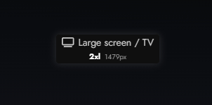

# Svelte Screen size Widget

[![npm][badge-version]][npm] [![license][badge-license]][license]  
[![npm downloads][badge-downloads]][npm] [![bundle size][badge-size]][bundlephobia]

A Svelte widget to display the current screen size.  
Must have for adaptive design developing.  
You can see name of current size-breakpoint & quick copy selector.



## Usage

```html
<script>
    import { ScreenSizeWidget } from "svelte-screensize-widget"
</script>

{#if import.meta.env.DEV}
    <ScreenSizeWidget />
{/if}
```

[badge-version]: https://img.shields.io/npm/v/svelte-screensize-widget.svg
[npm]: https://www.npmjs.com/package/svelte-screensize-widget

[badge-size]: https://img.shields.io/bundlephobia/minzip/svelte-screensize-widget.svg
[bundlephobia]: https://bundlephobia.com/result?p=svelte-screensize-widget

[badge-downloads]: https://img.shields.io/npm/dt/svelte-screensize-widget.svg

[badge-license]: https://img.shields.io/npm/l/svelte-screensize-widget.svg
[license]: https://github.com/Beelzebub/svelte-screensize-widget/blob/master/LICENSE
